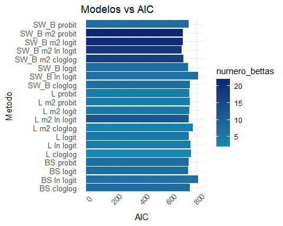

# Tener o no tener diabetes

En este estudio se trabajó con distintas variables para modelar si un paciente tenía o no diabetes. En concreto, las ocho variables consideradas fueron: `pregnant`, `glucose`, `pressure`, `triceps`, `insulin`, `mass`, `pedigree` y `age`.  
Mediante un modelo lineal generalizado (GLM) con familia binomial, se intentó modelar esta probabilidad, y el resultado se almacenó en la variable `diabetes`.

El objetivo de este análisis es determinar qué variables son las más relevantes para predecir la diabetes, utilizando diferentes métodos de selección de variables y comparando sus resultados.

## Modelos

Para la modelación de la diabetes se emplearon los siguientes modelos:

Modelo completo:

$$
\begin{aligned}
\text{logit}(\mathbb{P}(\text{diabetes} = 1)) = \beta_0 + \beta_1 \cdot \text{pregnant} + \beta_2 \cdot \text{glucose} + \beta_3 \cdot \text{pressure} \\ + \beta_4 \cdot \text{triceps} + \beta_5 \cdot \text{insulin}  + \beta_6 \cdot \text{mass} + \beta_7 \cdot \text{pedigree} + \beta_8 \cdot \text{age}
\end{aligned}
$$

Modelo con términos cuadráticos e interacciones: (Forma resumida, para no poner todas interacciones )

$$
\begin{aligned}
\text{logit}(\mathbb{P}(\text{diabetes} = 1)) &= \beta_0 + \sum_{i < j} \beta_{ij} \cdot X_i X_j + \beta_1 \cdot \text{pregnant}^2 + \beta_2 \cdot \text{glucose}^2 + \beta_3 \cdot \text{pressure}^2 + \beta_4 \cdot \text{triceps}^2 + \beta_5 \cdot \text{insulin}^2 \\
& + \beta_6 \cdot \text{mass}^2 + \beta_7 \cdot \text{pedigree}^2 + \beta_8 \cdot \text{age}^2
\end{aligned}
$$

## Métodos de selección de variables

Para la selección de variables se utilizaron distintos métodos, tales como: **Best Subset Selection**, **Stepwise Backward Selection** y **Lasso**.  
Estos métodos fueron programados como funciones en los siguientes chunks: `mejor_Subset`, `Stepwise` y `Funcion_lasso`, respectivamente.  
Esto permitió generalizar el modelo y facilitar su uso con distintos tipos de regresión, así como con diversas funciones de enlace, tales como `logit`, `probit` y `cloglog`.

### Abreviaciones para entender los resultados

**BS**: *Best Subset*  
**SW_B**: *Stepwise Backward*  
**L**: *Lasso*  
**Ln**: Transformación de los datos a logaritmo natural  
**m2**: Modelo 2 (Interacciones y variables elevadas al cuadrado)

Los resulados de los modelos fueron procesados en el chunk `Procesar_resultados`, donde se generaron los modelos y se almacenaron los resultados en un dataframe.

## Presentación de resultados

En esta sección se muestran los resultados obtenidos tras aplicar los diferentes modelos y métodos de selección de variables.  
La tabla incluye el método utilizado (en abreviatura), el valor de AIC obtenido y el número de betas (coeficientes) incluidos en el modelo.

Table: Tabla de resultados

|Metodo           |      AIC| numero_bettas|
|:----------------|--------:|-------------:|
|BS logit         | 739.4534|             7|
|SW_B logit       | 739.4534|             7|
|L logit          | 744.5088|             5|
|SW_B m2 logit    | 699.2151|            21|
|L m2 logit       | 746.6958|             5|
|BS probit        | 741.6711|             7|
|SW_B probit      | 741.6711|             7|
|L probit         | 746.7337|             4|
|SW_B m2 probit   | 698.3639|            22|
|L m2 probit      | 749.1099|             4|
|BS cloglog       | 751.7704|             7|
|SW_B cloglog     | 751.7704|             7|
|L cloglog        | 758.5877|             2|
|SW_B m2 cloglog  | 703.3488|            17|
|L m2 cloglog     | 771.3931|             3|
|BS ln logit      | 808.8056|             6|
|SW_B ln logit    | 808.8056|             6|
|L ln logit       | 757.2337|             4|
|SW_B m2 ln logit | 691.5618|            19|
|L m2 ln logit    | 740.2792|            12|

En esta tabla se presentan diversas combinaciones de modelos, funciones de enlace y transformaciones de variables.  
Se observa que un menor número de variables no siempre implica un menor AIC ni un mejor modelo.

En este caso, el mejor modelo fue aquel con función de enlace **logit**, transformación de variables mediante **logaritmo natural**, basado en el modelo **m2** y utilizando el método **Stepwise Backward**. Este modelo obtuvo un AIC de **691.56** y seleccionó un total de **19** variables.

En comparación, el modelo más simple utilizó la función de enlace **cloglog** y el método **Lasso**, seleccionando únicamente **2** variables y obteniendo un AIC de **758.58**.

Esto demuestra que fue necesario aplicar transformaciones a los datos y agregar interacciones para que los métodos de selección contaran con un mayor número de variables que permitieran mejorar el **AIC**.

En estas gráficas se muestran, de forma visual, los valores de **AIC** obtenidos por los distintos modelos. 

En esta gráfica el color representa la cantidad de variables utilizadas en cada modelo, lo que permite observar que aquellos modelos con mayor número de variables tienden a presentar un **AIC** más bajo, en este caso especifico de datos.  
En particular, se destaca que el método **Stepwise Backward** logra consistentemente valores de **AIC** más favorables.

En esta segunda gráfica se visualizan las variables que fueron seleccionadas con mayor frecuencia a lo largo de los distintos modelos.  
Las más destacadas fueron: **glucose**, **mass** y **age**.  
Esto sugiere que la probabilidad de tener diabetes es mayor en pacientes con niveles elevados de glucosa, mayor peso corporal y mayor edad.

## Interpretación del modelo seleccionado

En este modelo se observa que las variables con mayor magnitud en sus coeficientes —y, por tanto, mayor influencia— son: **age**, **pedigree** y **glucose**, todas con coeficientes negativos.

Esto indica que a mayor edad, mayor nivel de glucosa y mayor número de antecedentes familiares de diabetes (representado por `pedigree`), existe una mayor probabilidad de desarrollar esta enfermedad.  
Por lo tanto, la edad y la carga hereditaria son factores clave a considerar en el riesgo de diabetes, lo cual resalta la importancia de adoptar una buena alimentación y hábitos saludables como medida preventiva.

Referencias (Inspiracion de graficas):

Selección de predictores: subset selection, ridge, lasso y reducción de dimensionalidad por Joaquín Amat Rodrigo, disponible con licencia CC BY-NC-SA 4.0 en https://www.cienciadedatos.net/documentos/31_seleccion_de_predictores_subset_selection_ridge_lasso_dimension_reduction

